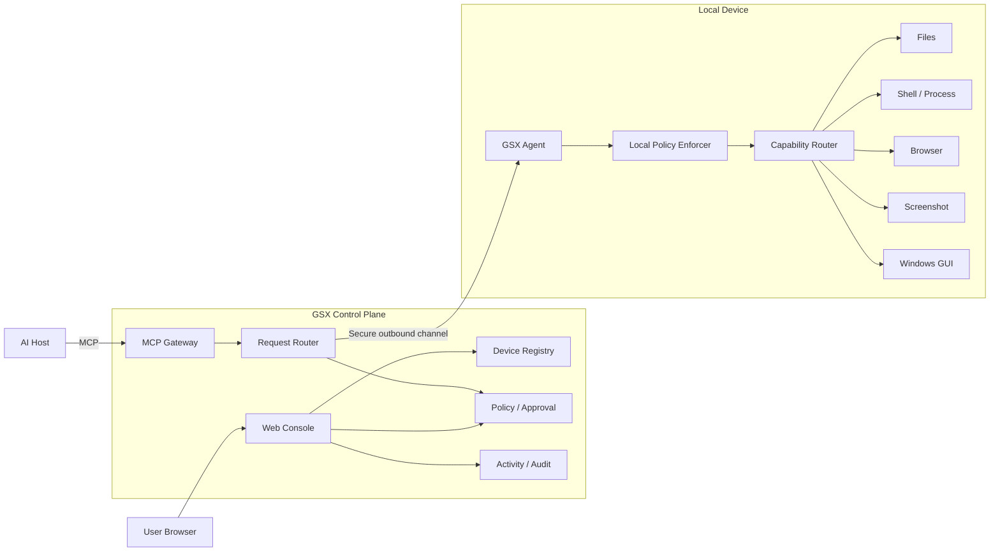

# GSX Remote Agent 架构设计

状态：Draft v0.2  
阶段：Architecture Baseline  
目标平台：Windows 优先，服务器侧兼容 Linux

> 详细图示见 [`docs/architecture/SYSTEM_OVERVIEW.md`](architecture/SYSTEM_OVERVIEW.md)。

## 1. 设计目标

GSX Remote Agent 的目标不是“让 AI 获得无限制电脑权限”，而是建立一个：

- 标准化：通过 MCP 暴露设备能力；
- 易用：设备只安装轻量 Agent，主要管理在 Web Console 完成；
- 可见：用户知道哪台设备在线、AI 正在做什么；
- 可控：权限、目录、程序、域名等可配置；
- 可中断：用户可 Pause / Cancel / Disconnect；
- 可审计：每次调用记录来源、策略决策、参数摘要和结果；
- 可替换：不绑定单一 AI 平台、Tunnel 或 Relay；
- Local-first：文件、Shell、Browser、GUI 等敏感执行发生在本机。

## 2. 核心架构决策

### ADR-01：Web Console First

采用 **轻量设备 Agent + Web Control Plane**。

本机 Agent 只保留状态、连接、执行、Browser Bridge、Pause / Resume 和诊断；设备管理、权限、Activity、审批等复杂管理能力放入 Web Console。

正式 ADR：[`docs/adr/ADR-001-web-console-first.md`](adr/ADR-001-web-console-first.md)。

### ADR-02：MCP 是外部协议边界

AI Host 只通过标准 MCP 使用 GSX Remote Agent。

内部 Device RPC 不直接暴露给 AI Host，避免外部协议与本地执行实现耦合。

### ADR-03：Control Plane 与 Local Execution 分离

Control Plane 负责：

- Auth / Session；
- Device Registry / Presence；
- MCP Gateway；
- Request Routing；
- Server Policy；
- Approval；
- Audit / Activity；
- Web Console。

Agent 负责：

- Device Identity；
- Persistent outbound connection；
- Local Policy Enforcer；
- Task Manager；
- Capability Registry；
- Browser Bridge；
- 本地执行与恢复。

### ADR-04：Transport 可替换

支持路线：

1. Local stdio / Streamable HTTP；
2. OpenAI Secure MCP Tunnel；
3. GSX Control Plane 的 Agent 长连接；
4. 未来自建 / self-hosted Relay；
5. 其他 MCP-compatible transport。

OpenAI Tunnel 是可选适配器，不是核心依赖。

### ADR-05：Capability First

第一版优先结构化能力，不优先做传统远程桌面视频流。

能力顺序：

1. Device / Health
2. Files
3. Shell / Process
4. Browser
5. Screenshot
6. Windows GUI
7. Docker / Git / SSH 等扩展

## 3. 总体组件



## 4. 推荐技术方向

### Agent

Windows MVP：

- Rust Agent Core；
- Tauri 2 极简状态窗口；
- System Tray；
- Auto Start；
- SQLite / structured local diagnostics；
- HTTPS/WSS outbound connection；
- Capability Registry；
- Local Policy Enforcer。

Agent UI 不承载复杂设备管理。

### Web Console

主要产品界面：

```text
Devices
Connections
Policies
Activity
Settings
```

优先使用表格、列表、Tabs、Dialog 等标准管理界面，不做首页大屏和无意义统计卡。

### Control Plane

第一版包含：

- Device Registry / Presence；
- Agent connection manager；
- MCP Gateway；
- Request Router；
- Policy evaluator；
- Approval state；
- Audit store；
- Web API。

### Browser Worker

- Playwright；
- CDP；
- Visible Chrome / Edge / Chromium；
- GSX Managed Browser Profile；
- 与 Agent Core 进程隔离。

优先级：

```text
DOM / Accessibility
→ Playwright Locator
→ CDP
→ Screenshot / Vision
→ Mouse / Keyboard fallback
```

### Windows GUI Provider

按顺序尝试：

1. Windows UI Automation / Accessibility；
2. Win32 Window APIs；
3. Screenshot + Vision；
4. Mouse / Keyboard fallback。

## 5. Capability Contract

所有能力使用统一元数据：

```text
capability_id
version
input_schema
result_schema
risk_level
required_scope
execution_mode
timeout
cancellable
audit_metadata
```

权限统一三态：

```text
Allow / Ask / Deny
```

策略至少可匹配：

- device；
- capability；
- path；
- executable；
- domain；
- risk_level；
- source session。

Agent 必须做本地二次校验，不能只依赖 Control Plane。

## 6. Agent ↔ Control Plane 协议

优先长连接：

```text
HTTPS / WSS outbound
```

基础消息：

```text
device.hello
device.heartbeat
device.status
policy.sync
execution.request
execution.accepted
execution.progress
execution.result
execution.error
execution.cancel
```

所有执行请求至少包含：

```text
request_id
device_id
session_id
capability_id
risk_level
policy_context
timestamp
```

## 7. 安全执行链

```text
AI Tool Call
→ MCP Schema Validation
→ Session / Device Binding
→ Server Policy Evaluation
→ Optional User Approval
→ Route to Agent
→ Local Policy Check
→ Capability Execution
→ Result Filtering
→ Audit / Activity
→ Return to AI Host
```

Kill Switch / Pause Agent 优先级高于任何 AI 请求。

## 8. Prior Art 边界

- ZeroTier：参考轻 Agent + Central Web 管理产品形态；
- OpenAI `tunnel-client`：可选 Transport；
- DesktopCommanderMCP：参考 Files / Shell / Process 和长任务设计；
- Remote Desktop Commander：参考设备连接和 UX，Hosted Relay 不作为硬依赖；
- Playwright：Browser 执行；
- MCP official SDK：外部协议实现。

第三方源码正式引入前必须单独做许可证与依赖审查。

## 9. 设计验收标准

在进入大规模实现前必须回答清楚：

- Agent 和 Control Plane 的职责是否明确？
- AI Host 是否只依赖稳定 MCP Tool Contract？
- 管理能力是否默认放 Web，而不是继续膨胀 Agent？
- 所有高权限调用是否经过 Policy / Audit？
- Agent 是否可以本地拒绝云端请求？
- Browser Profile 是否可持久化？
- Transport 是否可替换？
- 用户是否能一键 Pause Agent？

若这些条件未满足，则仍处于架构阶段。
