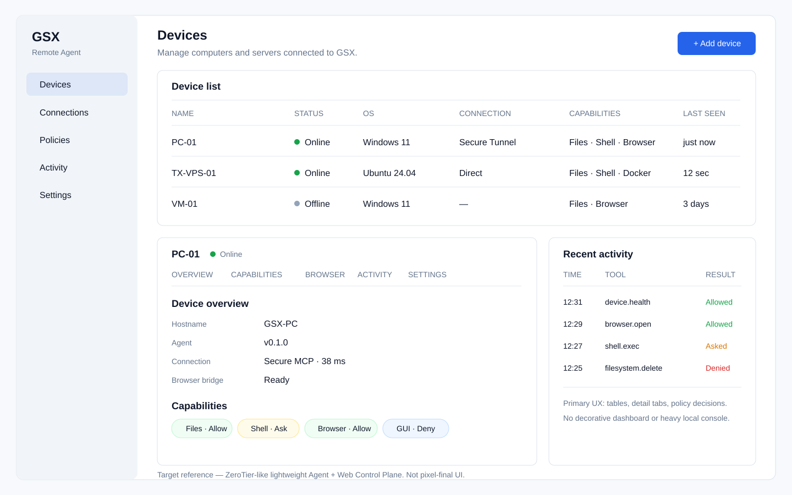
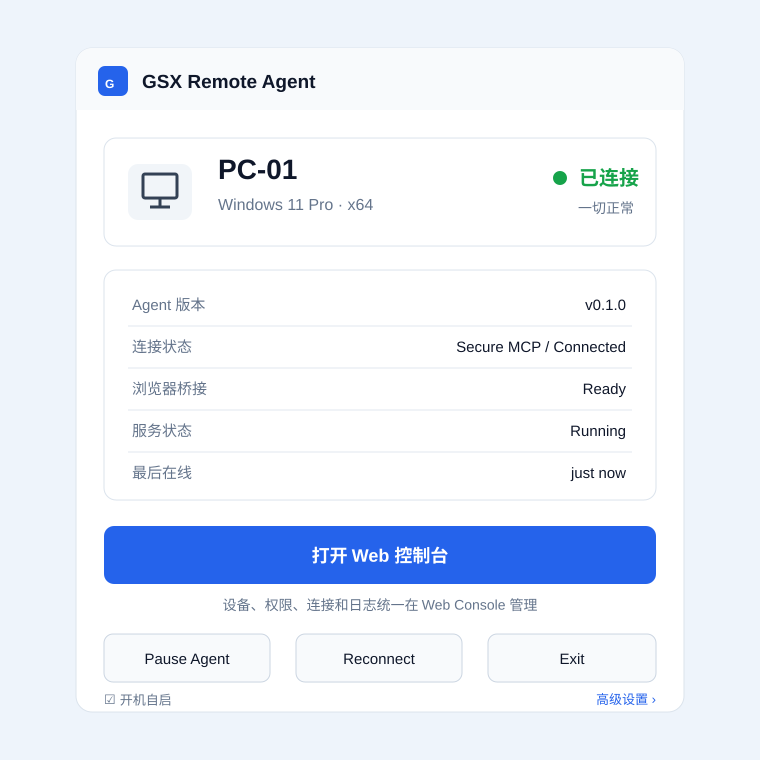
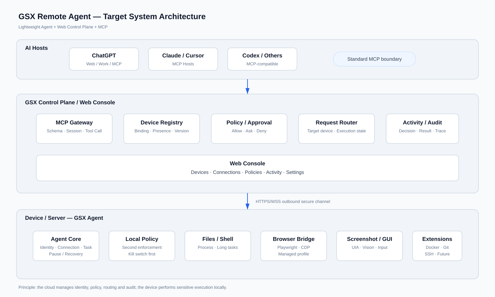
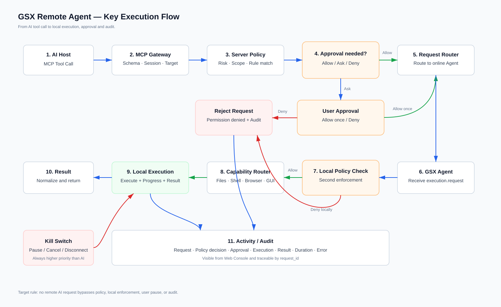
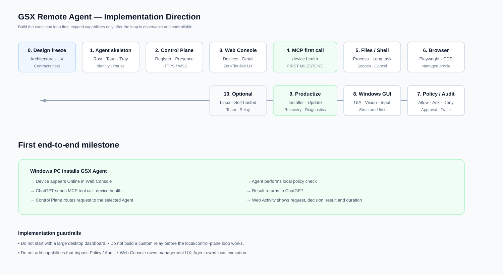

# GSX Remote Agent Design Target

状态：Target Baseline v0.2  
用途：后续开发、评审、重构和 UI 实现的统一目标导向入口。

## 1. 产品形态

> **Lightweight Agent + Web Control Plane**

电脑 / 服务器只安装一个轻量 Agent；设备管理、权限、连接、Activity、审批和设置统一进入 Web Console。

- [产品方向](product/PRODUCT_DIRECTION.md)
- [目标 UI](product/TARGET_UI.md)
- [ADR-001：Web Console First](adr/ADR-001-web-console-first.md)

## 2. 目标界面

### Web Console



### Minimal Local Agent



## 3. 系统架构目标



详细说明：

- [系统架构总览](architecture/SYSTEM_OVERVIEW.md)
- [架构设计](ARCHITECTURE.md)

## 4. 关键执行流程



详细说明：

- [关键执行流程](product/KEY_FLOW.md)

## 5. 实现路线



详细说明：

- [实现方向](product/IMPLEMENTATION_DIRECTION.md)
- [MVP Roadmap](ROADMAP.md)

## 6. 后续实现必须遵守的目标约束

1. **Agent 要轻**：不要重新演化成大而全桌面控制台。
2. **Web 管理优先**：Devices / Policies / Activity / Settings 默认在 Web。
3. **本地执行**：敏感能力尽可能在目标设备执行。
4. **MCP 是稳定外部边界**：内部 Agent RPC 不直接暴露给 AI Host。
5. **Transport 可替换**：OpenAI Tunnel、未来 Relay 都不能成为不可替换核心。
6. **结构化能力优先**：DOM / UIA / API 优先于纯坐标点击。
7. **安全链不可绕过**：Policy → Approval → Local Check → Execute → Audit。
8. **用户始终能暂停**：Kill Switch / Pause 高于任何 AI 请求。
9. **先闭环再扩功能**：首个里程碑是 `device.health` 的完整远程调用闭环，而不是 UI 数量。
10. **保持克制**：不为“科技感”增加无意义卡片、图表、动画和复杂装饰。

## 7. 首个验收闭环

```text
Windows 安装 Agent
→ 设备绑定
→ Web Console 显示 Online
→ ChatGPT / MCP Host 调 device.health
→ Control Plane 选择目标设备
→ Agent 本地策略校验
→ Agent 执行并返回结果
→ Activity / Audit 出现完整记录
```

完成上述闭环后，才进入 Files / Shell / Browser 等能力扩展。
