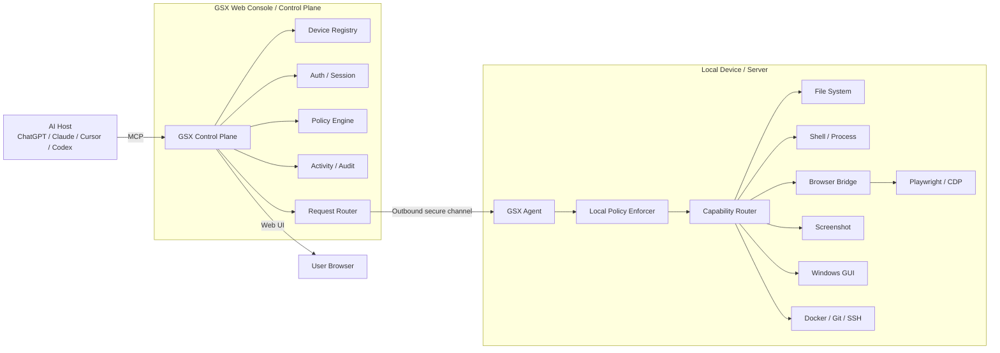
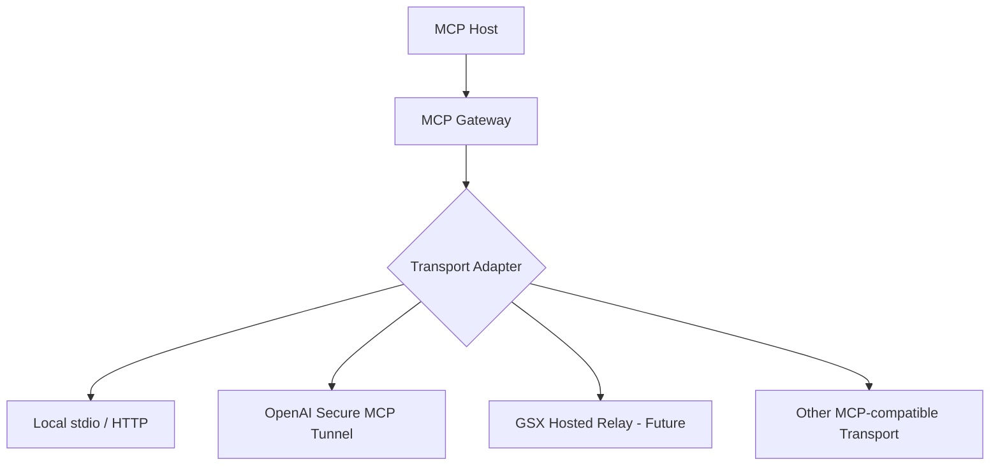
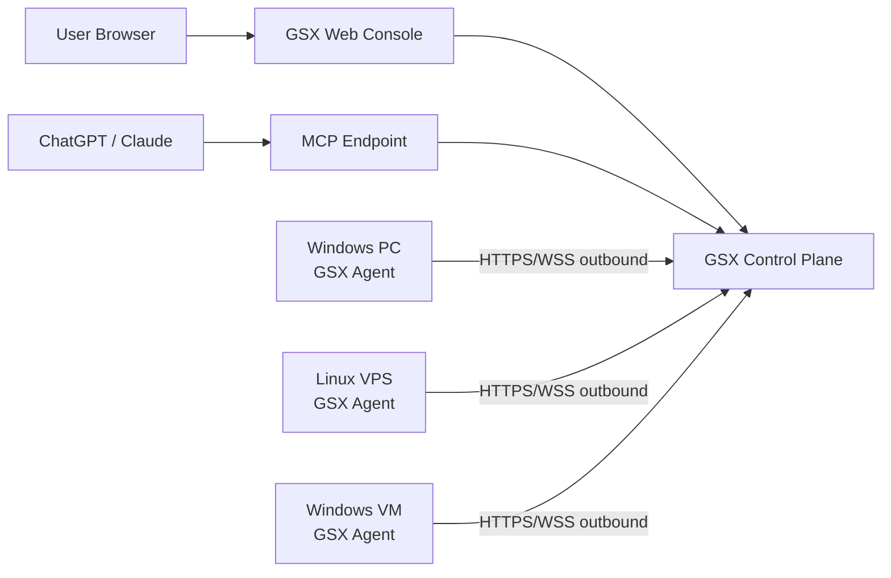

# GSX Remote Agent 系统架构总览

状态：Target Architecture v0.2

## 1. 总体架构



## 2. 分层原则

### AI Host

只依赖标准 MCP，不感知具体设备实现。

### GSX Control Plane

负责：

- 账号与会话；
- Device Registry；
- MCP 接入与请求路由；
- 权限策略；
- 高风险确认；
- Activity / Audit；
- Web Console。

### GSX Agent

负责：

- 本机设备身份；
- 主动出站连接；
- 请求执行；
- 本地权限二次校验；
- Capability 生命周期；
- Browser Bridge；
- 自动恢复与升级。

### Capability Layer

能力以统一接口注册：

```text
capability_id
schema
risk_level
required_scope
execution_mode
result_schema
```

Control Plane 不直接实现本机能力。

## 3. Transport 设计

Transport 必须可替换。



OpenAI Tunnel 是可选适配器，不是系统核心。

## 4. Control Plane 与 Agent 的边界

| Control Plane | Agent |
|---|---|
| 设备管理 | 本地执行 |
| 用户身份 | 设备身份 |
| 策略配置 | 策略强制 |
| 请求路由 | Capability 调用 |
| 确认流程 | Browser / Shell / File 等能力 |
| 审计查询 | 本地最小日志与恢复 |
| Web UI | 极简状态窗口 / Tray |

## 5. 安全边界

请求执行前至少经过：

```text
AI Request
→ MCP Schema Validation
→ Session / Device Binding
→ Server Policy Evaluation
→ Optional User Approval
→ Agent Local Policy Check
→ Capability Execution
→ Result Filtering
→ Audit Record
```

任何单一远程服务失效都不应自动获得无限本机权限。

## 6. 目标部署形态



所有设备默认主动出站连接，尽量不要求用户配置公网端口或 NAT 入站规则。
