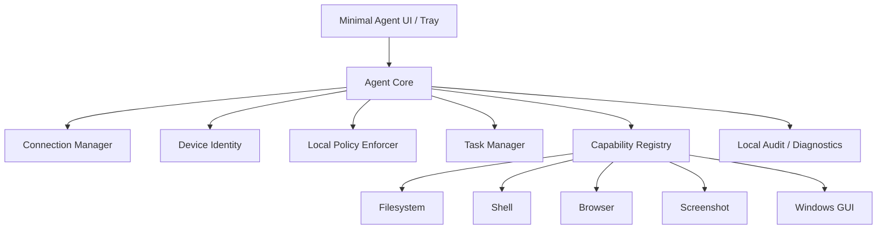
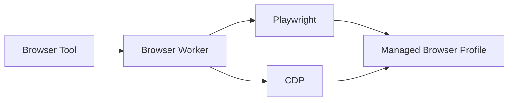
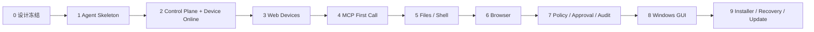

# GSX Remote Agent 实现方向

状态：Implementation Direction v0.2

## 1. 总原则

实现顺序不从“做一个漂亮桌面客户端”开始，而从可验证的系统闭环开始：

```text
设备 Agent
→ Control Plane
→ MCP 请求
→ Policy
→ Capability
→ Result / Audit
→ Web Console 可见
```

## 2. 目标工程拆分

```text
GSX-Remote-Agent/
├── apps/
│   ├── agent-desktop/       # Windows 轻量 Agent
│   └── web-console/         # Web 管理台
├── services/
│   ├── control-plane/       # Device / Policy / Audit / Routing
│   └── mcp-gateway/         # MCP 接入
├── packages/
│   ├── protocol/            # 设备协议与共享 schema
│   ├── capability-sdk/      # Capability contract
│   ├── policy/              # Policy types / evaluator
│   └── ui/                  # Web 共享组件
├── capabilities/
│   ├── filesystem/
│   ├── shell/
│   ├── browser/
│   ├── screenshot/
│   └── windows-gui/
└── docs/
```

实际 Monorepo 工具在工程初始化阶段再冻结，当前不绑定 pnpm/Turborepo/Nx。

## 3. Agent 实现方向

### 技术形态

Windows 优先：

- 核心服务：Rust；
- 极简桌面壳：Tauri 2；
- Tray + Auto Start；
- 本地 SQLite / structured log；
- Capability 统一注册；
- 网络连接由单独 Connection Manager 管理。

### Agent 内部模块



## 4. Web Console 实现方向

Web Console 是主要产品界面。

第一版只做必要页面：

1. `/devices`
2. `/devices/:id`
3. `/policies`
4. `/activity`
5. `/settings`

不做首页大屏，不做无意义统计卡。

页面组件优先：

- Data Table
- Status Badge
- Tabs
- Drawer / Dialog
- Command / Search
- Confirmation Dialog
- Activity Timeline

## 5. Control Plane 实现方向

Control Plane 第一版需要：

- User / Session；
- Device Registry；
- Device Presence；
- Agent Connection；
- Request Router；
- Policy Store + Evaluator；
- Approval State；
- Audit Store；
- MCP Gateway integration。

不需要：

- 多租户计费；
- 团队 RBAC；
- 插件商店；
- 复杂组织架构。

## 6. Agent ↔ Control Plane 协议

第一版优先使用长连接：

```text
HTTPS/WSS outbound
```

基本消息：

```text
device.hello
device.heartbeat
device.status
policy.sync
execution.request
execution.accepted
execution.progress
execution.result
execution.error
execution.cancel
```

所有请求必须带：

```text
request_id
device_id
session_id
capability_id
risk_level
policy_context
timestamp
```

## 7. MCP Gateway

AI Host 只看到稳定 MCP Tools，不直接看到内部 Agent RPC。

示例：

```text
device.list
device.health
filesystem.list
filesystem.read
filesystem.write
shell.exec
process.start
process.read
process.cancel
browser.open
browser.inspect
browser.click
browser.type
screenshot.capture
```

Gateway 负责把 MCP Tool Call 转换为内部 Execution Request。

## 8. Browser 实现方向

Browser 独立为 Worker，避免浏览器崩溃拖垮 Agent Core。



第一版默认 Managed Profile；“接管当前用户默认 Chrome”作为后续兼容能力，不阻塞 MVP。

## 9. Permission / Policy

统一三态：

```text
Allow / Ask / Deny
```

策略匹配维度：

- device
- capability
- file path
- executable
- domain
- risk level
- source AI / session

Agent 必须执行本地二次校验，避免仅依赖云端策略。

## 10. 开发阶段



### 第一个真正的里程碑

不是“窗口画出来”，而是：

> 一台 Windows PC 安装 Agent → Web Console 显示 Online → ChatGPT 通过 MCP 调 `device.health` → Agent 返回结果 → Activity 有完整记录。

做到这个闭环后再扩大 Capability。

## 11. Prior Art 使用原则

- OpenAI `tunnel-client`：参考/可选远程 Transport；
- DesktopCommanderMCP：参考 Files/Shell/Process 能力与长任务设计；
- Remote Desktop Commander：参考设备连接和 UX，不依赖其 Hosted Relay；
- ZeroTier：参考轻 Agent + Central 管理产品形态；
- Playwright：Browser 执行层；
- MCP official SDK：协议实现。

优先复用思想和成熟组件，第三方源码引入前单独审许可证和依赖边界。
