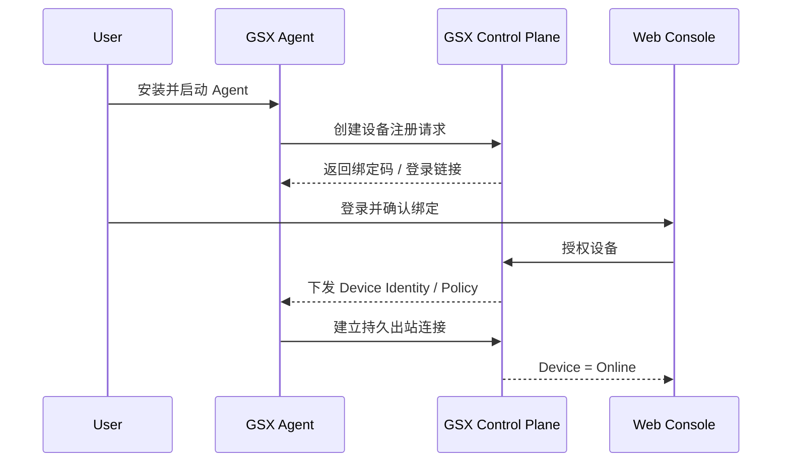
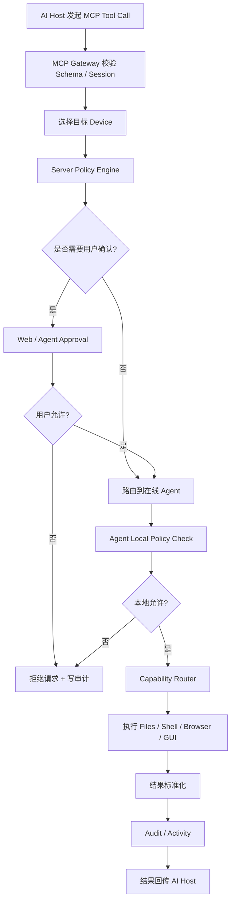
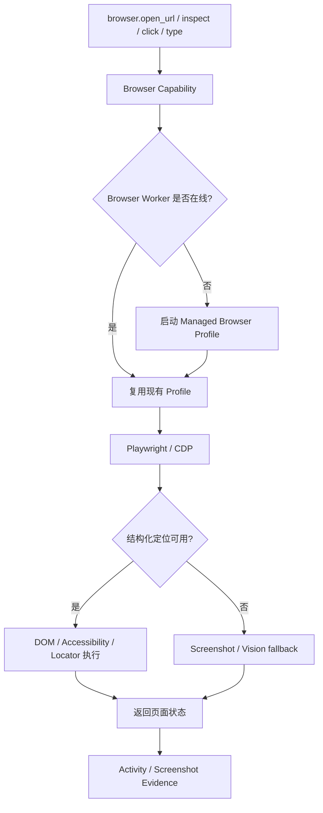
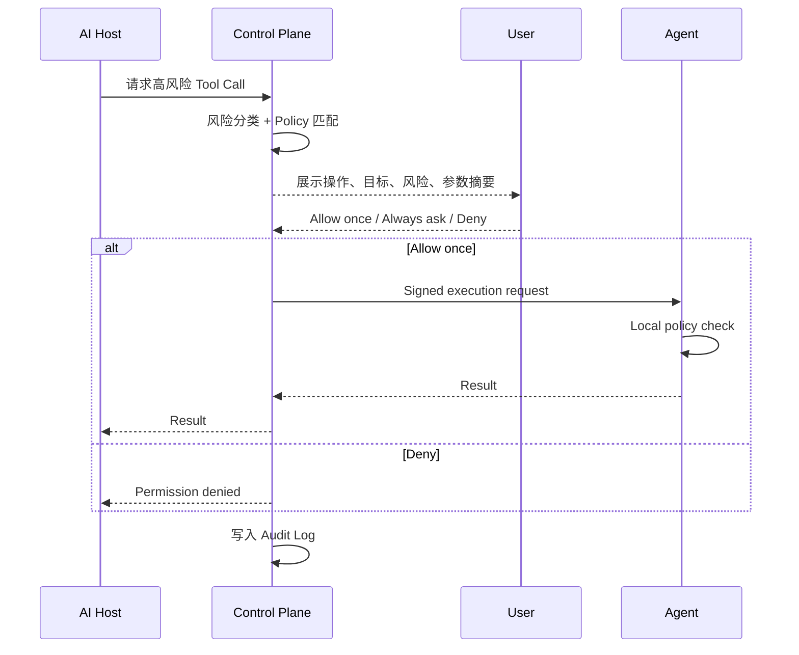
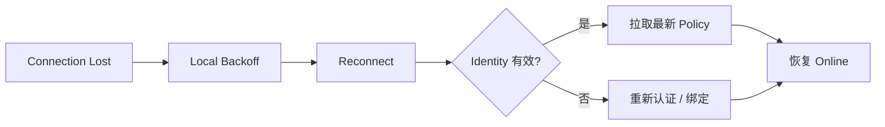

# GSX Remote Agent 关键执行流程

状态：Target Flow v0.2

## 1. 设备首次接入



目标：用户不手改 JSON、不开放公网端口、不常驻 CMD。

## 2. AI 调用设备能力



## 3. 浏览器任务流程



浏览器执行优先级：

```text
DOM / Accessibility
→ Playwright Locator
→ CDP
→ Screenshot / Vision
→ Mouse / Keyboard fallback
```

## 4. 高风险操作确认

典型高风险：删除文件、安装软件、系统配置修改、发送/提交、敏感目录写入等。



## 5. 用户随时干预

```text
Pause Agent
→ Agent 停止接收新任务
→ 当前可取消任务进入 Cancel
→ Control Plane 标记 Paused
→ AI 新请求返回 Device Paused
```

Kill Switch 必须优先于任何 AI 请求。

## 6. Agent 断线恢复



目标：断网、休眠、进程崩溃后能够自动恢复，不依赖用户打开终端重启。
